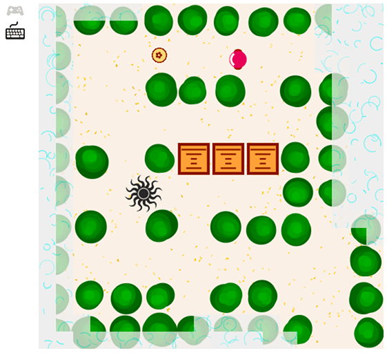

# W3Cx: HTML5.2x HTML5 Part 2: Advanced Techniques for Designing HTML5 Apps

A one-level simple game I did for the course:

* HTML5
  * gamepad
  * audio context
  * canvas
* minimize with
  * Google Closure Compiler
  * TinyPNG
* Game framework
  * gamepad/keyboard input
  * canvas blending
  * collision detection
  * A-star path finding
  * sprite sheets
  * fog of war

Play the game: [paiv.github.io/html5.2x.game][1]

[][1]

[1]: http://paiv.github.io/html5.2x.game/
